## Introduce
## Features:
- OnBoarding.
- Product List.
- Search Product.
- Product Detail.
- Bookmark Product.

## ScreenShot:

<div style="display: flex; justify-content: space-around;">
    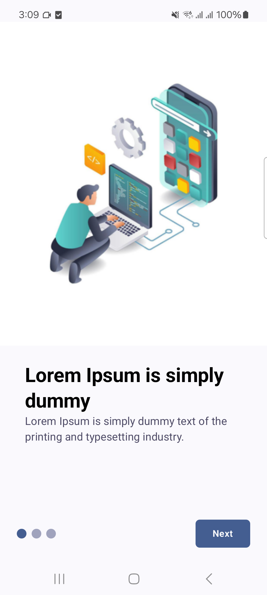
    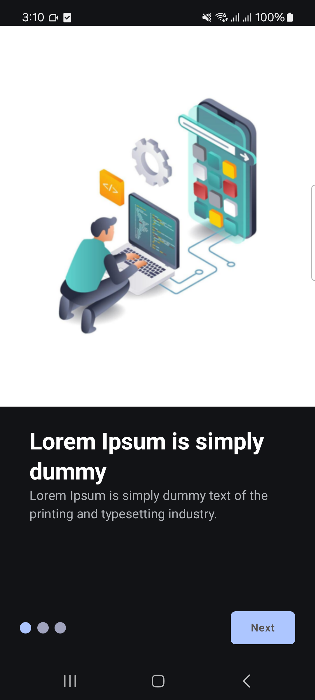
</div>

<div style="display: flex; justify-content: space-around;">
    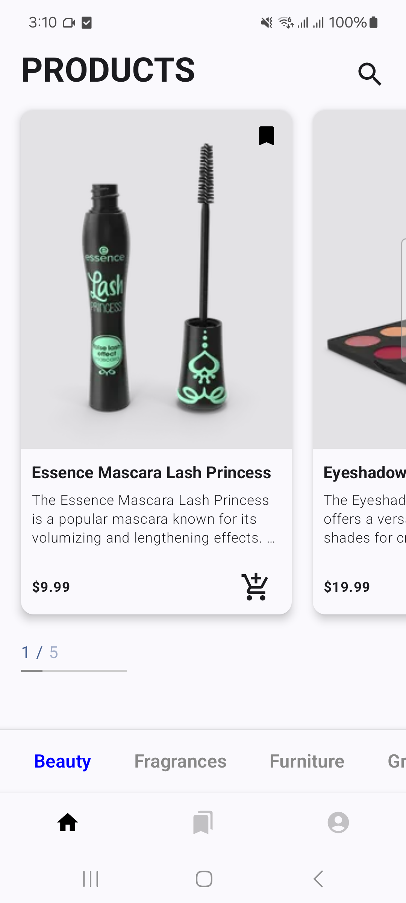
    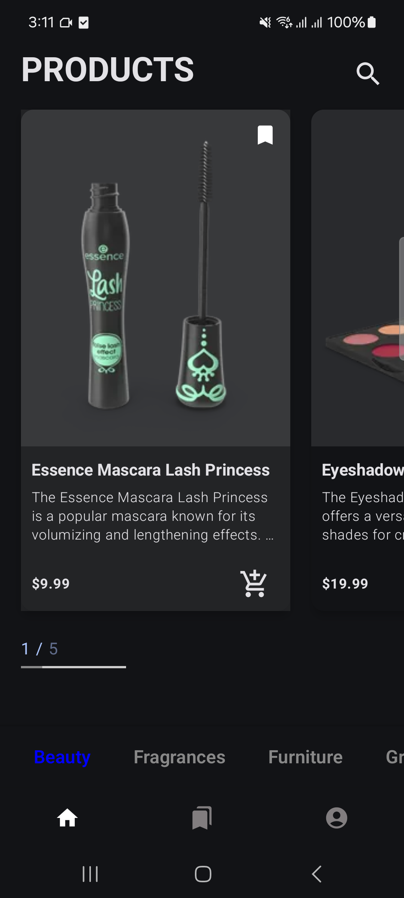
</div>

<div style="display: flex; justify-content: space-around;">
    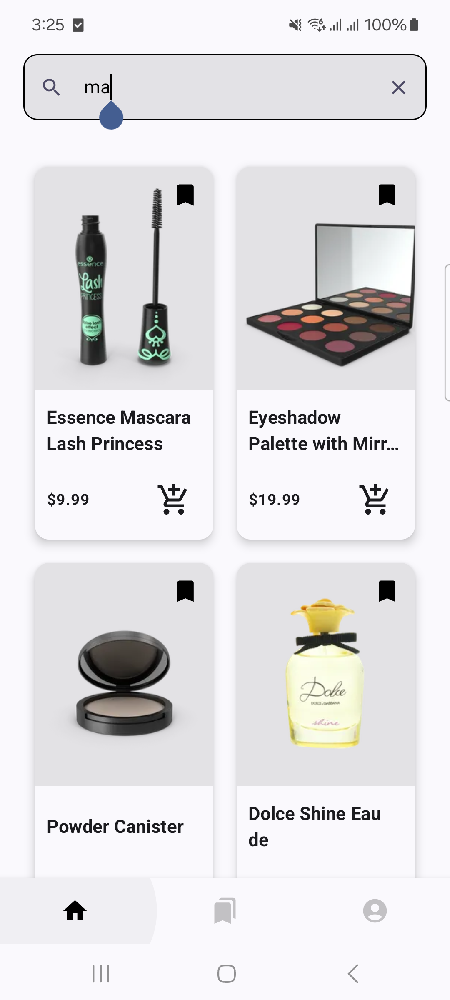
    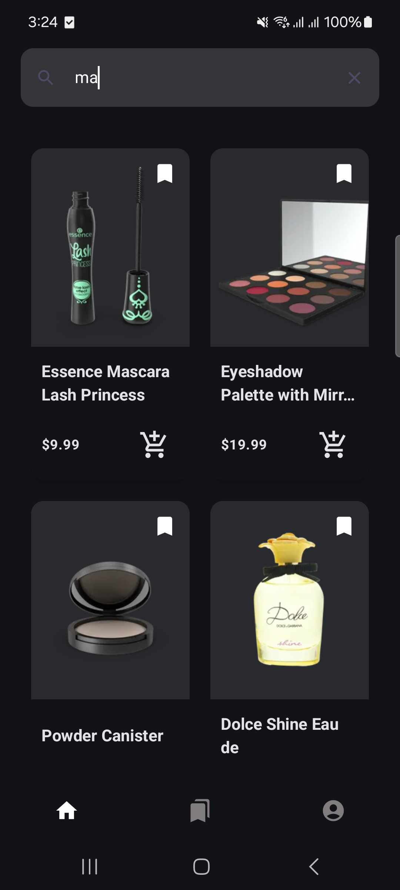
</div>

<div style="display: flex; justify-content: space-around;">
    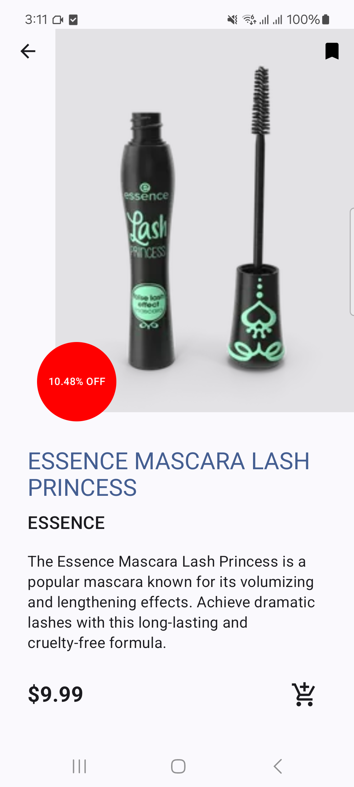
    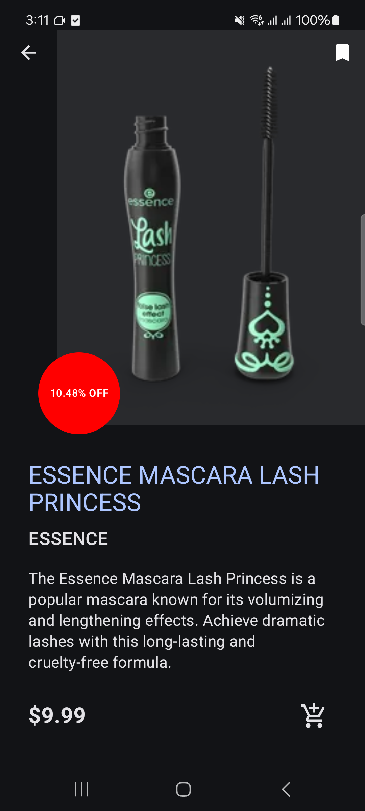
</div>

<div style="display: flex; justify-content: space-around;">
    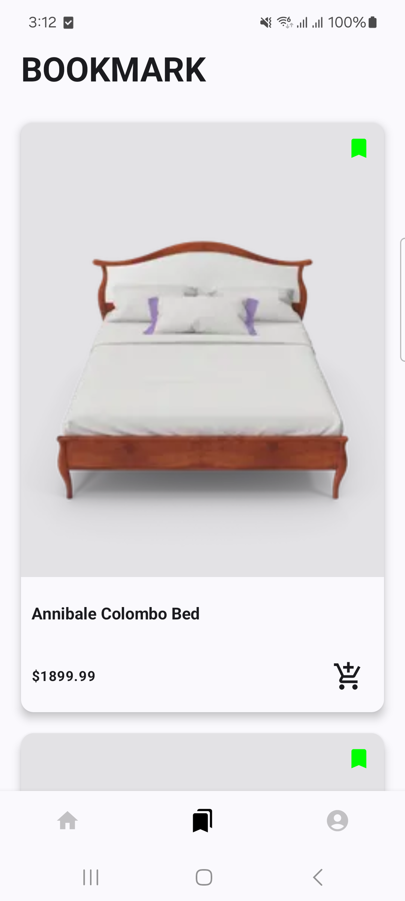
    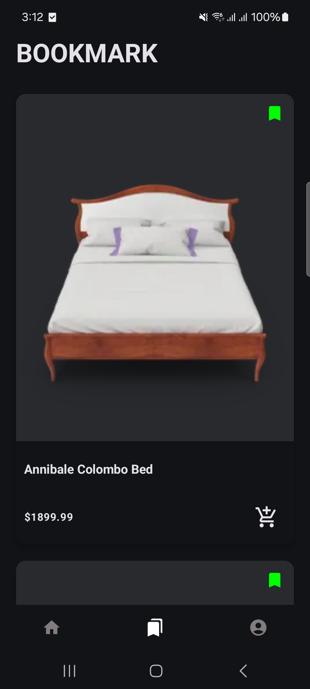
</div>

## Architecture
**JetPack Compose** [https://developer.android.com/compose]
 **MVVM**

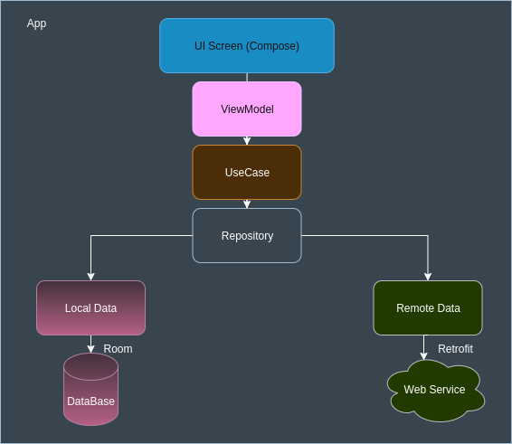

## Library reference resources

**AndroidX Compose** : [https://www.googleadservices.com/pagead/aclk?sa=L&ai=DChsSEwiY1Yze57GOAxWULIMDHbXdEQ0YACICCAEQABoCc2Y&co=1&ase=2&gclid=CjwKCAjwyb3DBhBlEiwAqZLe5PJ2d_GGiOx2U5T-fTIuvJnC2hAisqUUWntGGPXAUJ7ZXLz1B4B_9RoC-9gQAvD_BwE&ohost=www.google.com&cid=CAESVuD2YjwKY1YA1w1srbSVv_mAoqUhR75tOJ5L8CdkMOaowG5YEOyI-U84FwCqtBif6RYzcJDNuDlKjya3gt3Gbw0JdBvA7PVrlo-9loa2IZ1vestRKEC9&category=acrcp_v1_45&sig=AOD64_3y8y15Vc9hcywfrCR8Un5c9EQhxQ&q&nis=4&adurl&ved=2ahUKEwj_8Yje57GOAxVSUGwGHb1sN-cQ0Qx6BAgJEAE]

**Hilt** : [https://dagger.dev/hilt/]

**Coroutines** : [https://developer.android.com/kotlin/coroutines]

**Room** : [https://developer.android.com/jetpack/androidx/releases/room]

**Retrofit** : [https://github.com/square/retrofit]

**Android Paging** : [https://developer.android.com/jetpack/androidx/releases/paging]

**Coil** : [https://coil-kt.github.io/coil/]

## License
 ```
    Copyright (C) 2017 MINDORKS NEXTGEN PRIVATE LIMITED
 
    Licensed under the Apache License, Version 2.0 (the "License");
    you may not use this file except in compliance with the License.
    You may obtain a copy of the License at
 
        http://www.apache.org/licenses/LICENSE-2.0
 
    Unless required by applicable law or agreed to in writing, software
    distributed under the License is distributed on an "AS IS" BASIS,
    WITHOUT WARRANTIES OR CONDITIONS OF ANY KIND, either express or implied.
    See the License for the specific language governing permissions and
    limitations under the License.
 ```
