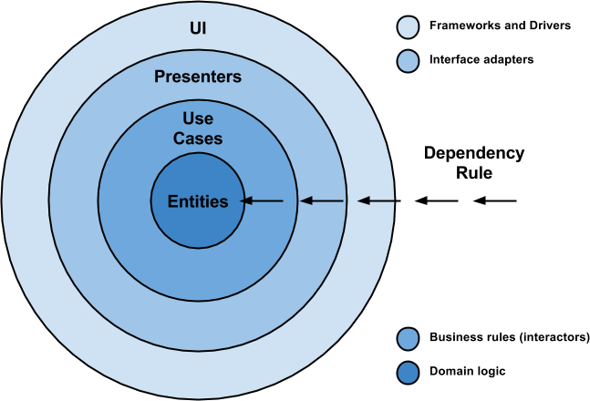
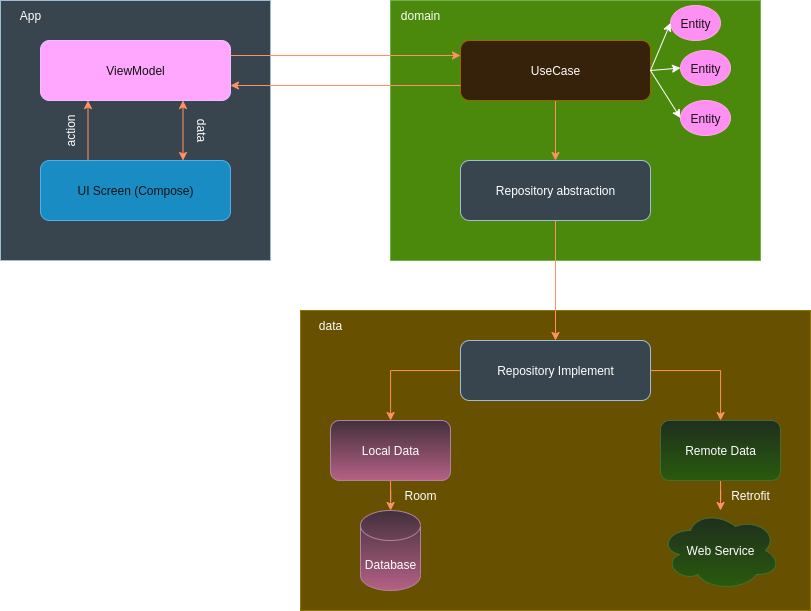
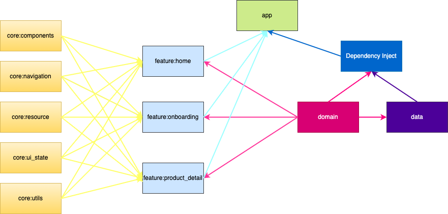

## Introduce

The sample app shopping product from api [https://dummyjson.com/docs] demo for jetpack compose

## More Features:
Migrade to clean architecture 

## Features:
- OnBoarding.
- Product List.
- Search Product.
- Product Detail.
- Bookmark Product.

## ScreenShot:

<div style="display: flex; justify-content: space-around;">
    
    <span style="width: 40px; display: inline-block;"></span>
    
</div>

<div style="display: flex; justify-content: space-around;">
    
    <span style="width: 40px; display: inline-block;"></span>
    
</div>

<div style="display: flex; justify-content: space-around;">
    
    <span style="width: 40px; display: inline-block;"></span>
    
</div>

<div style="display: flex; justify-content: space-around;">
    
    <span style="width: 40px; display: inline-block;"></span>
    
</div>

<div style="display: flex; justify-content: space-around;">
    
    <span style="width: 40px; display: inline-block;"></span>
    
</div>

## Architecture
**Clean Architecture - MVVM**

<div style="display: flex; justify-content: space-around;">
    
    <span style="width: 20px; display: inline-block;"></span>
    
</div>

<span style="height: 40px; display: inline-block;"></span>

**Modularization** : [https://developer.android.com/topic/modularization]



## Library reference resources

**Android Jetpack** : [https://developer.android.com/jetpack]

**AndroidX Compose** : [https://developer.android.com/compose]

**Hilt** : [https://dagger.dev/hilt/]

**Coroutines** : [https://developer.android.com/kotlin/coroutines]

**Room** : [https://developer.android.com/jetpack/androidx/releases/room]

**Retrofit** : [https://github.com/square/retrofit]

**Android Paging** : [https://developer.android.com/jetpack/androidx/releases/paging]

**Coil** : [https://coil-kt.github.io/coil/]

## License
 ```
    Copyright (C) 2017 MINDORKS NEXTGEN PRIVATE LIMITED
 
    Licensed under the Apache License, Version 2.0 (the "License");
    you may not use this file except in compliance with the License.
    You may obtain a copy of the License at
 
        http://www.apache.org/licenses/LICENSE-2.0
 
    Unless required by applicable law or agreed to in writing, software
    distributed under the License is distributed on an "AS IS" BASIS,
    WITHOUT WARRANTIES OR CONDITIONS OF ANY KIND, either express or implied.
    See the License for the specific language governing permissions and
    limitations under the License.
 ```
